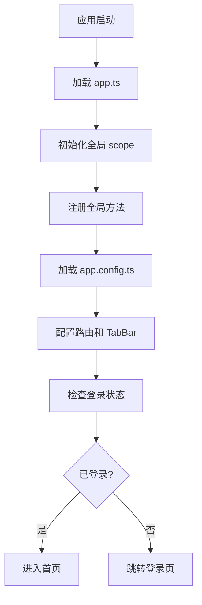
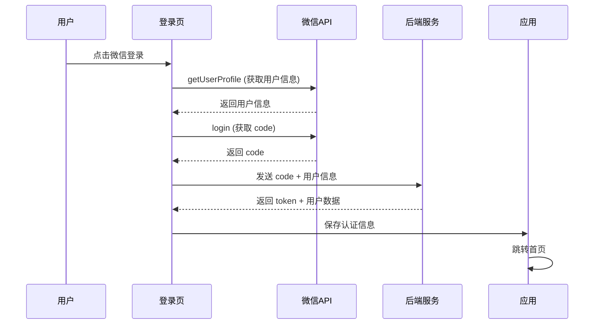
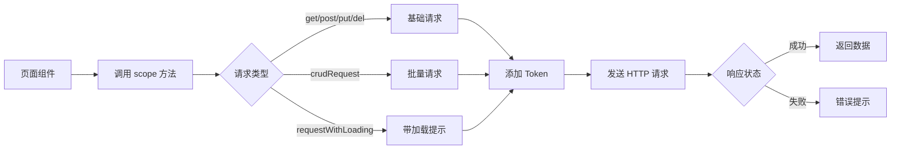

# Taro Soul 项目文档

## 项目概述

**Taro Soul** 是一个基于 Taro 框架开发的多端应用（支持小程序和 H5），主要用于数据管理和材料库存管理系统。

### 核心功能
- 数据总览与产能分析
- 订单/数据管理
- 材料库存管理
- 用户权限管理

---

## 技术栈

| 类别 | 技术 | 版本 |
|------|------|------|
| 框架 | Taro | 4.0.9 |
| UI库 | React | 18.0.0 |
| 组件库 | NutUI React Taro | 3.0.19 |
| 语言 | TypeScript | 5.4.5 |
| 构建工具 | Vite | 4.2.0 |
| 样式 | TailwindCSS | 4.1.18 |
| 样式预处理 | Sass | 1.75.0 |

---

## 目录结构

```
taro-soul/
├── config/                    # 配置文件目录
│   ├── index.ts              # 主配置文件
│   ├── dev.ts                # 开发环境配置
│   └── prod.ts               # 生产环境配置
│
├── src/                       # 源代码目录
│   ├── app.ts                # 应用入口
│   ├── app.config.ts         # 应用配置（路由、TabBar等）
│   ├── app.scss              # 全局样式
│   │
│   ├── pages/                # 页面目录
│   │   ├── index/            # 首页 - 数据总览
│   │   │   ├── index.tsx
│   │   │   └── index.scss
│   │   │
│   │   ├── login/            # 登录页
│   │   │   └── index.tsx
│   │   │
│   │   ├── shop/             # 材料库
│   │   │   ├── index.tsx
│   │   │   └── index.scss
│   │   │
│   │   ├── hall/             # 数据列表
│   │   │   ├── index.tsx
│   │   │   └── index.scss
│   │   │
│   │   ├── profile/          # 个人中心
│   │   │   ├── index.tsx
│   │   │   ├── index.scss
│   │   │   ├── components/   # 个人中心子组件
│   │   │   ├── agreement/    # 用户协议
│   │   │   ├── privacy/      # 隐私政策
│   │   │   └── userinfo/     # 个人信息
│   │   │
│   │   └── order-detail/     # 订单详情
│   │       └── index.tsx
│   │
│   ├── data/                 # 数据目录
│   │   └── mock.ts           # Mock 数据
│   │
│   ├── hooks/                # 自定义 Hooks
│   │   └── useAuthGuard.ts   # 权限守卫
│   │
│   └── utils/                # 工具函数
│       └── scope.ts          # 全局状态与工具库
│
├── types/                     # 类型定义
│   └── global.d.ts           # 全局类型声明
│
├── .cursor/rules/            # 编辑器规则
├── babel.config.js           # Babel 配置
├── package.json              # 项目依赖
├── tsconfig.json             # TypeScript 配置
├── project.config.json       # 微信小程序配置
└── .env.*                    # 环境变量文件
```

---

## 核心工作流程

### 1. 应用启动流程



**入口文件：** `src/app.ts`

```typescript
// 全局 scope 初始化
Object.assign(globalThis, scope1)

// 应用配置
export default defineAppConfig({
  pages: [...],
  tabBar: {...}
})
```

### 2. 用户认证流程



**文件位置：** `src/pages/login/index.tsx`

**认证存储：**
```typescript
// 保存在 scope.storage
{
  token: string,           // 7天有效期
  userInfo: object,        // 用户信息
  expireTime: timestamp    // 过期时间
}
```

### 3. 数据请求流程



**核心文件：** `src/utils/scope.ts`

**请求示例：**
```typescript
// 基础请求
const data = await scope.get('/api/user/info')

// 带加载提示的请求
const result = await scope.requestWithLoadingAndPagination(
  '/batch',
  { entity: 'order', action: 'list', page: 1, pageSize: 10 }
)

// 批量操作
await scope.crudRequest({
  entity: 'material',
  action: 'update',
  data: { id: 1, stock: 100 }
})
```

---

## 页面功能详解

### 1. 首页 (`pages/index`)

**功能：**
- 数据总览卡片
- 产能走势图表
- 周/月/年视图切换
- 员工列表展示

**关键组件：**
```typescript
// 视图切换
const [activeRange, setActiveRange] = useState<"week" | "month" | "year">("week")

// 数据汇总
const summaryData = useMemo(() => {
  // 计算汇总数据
}, [dataSource, activeRange])
```

**文件：** `src/pages/index/index.tsx`

---

### 2. 数据列表 (`pages/hall`)

**功能：**
- 订单/数据列表展示
- 下拉刷新
- 上拉加载更多
- 订单详情跳转

**路由跳转：**
```typescript
// 跳转订单详情
scope.goto({
  url: '/pages/order-detail/index',
  params: { id: orderId }
})
```

**文件：** `src/pages/hall/index.tsx`

---

### 3. 材料库 (`pages/shop`)

**功能：**
- 材料搜索
- 材料列表展示
- 库存状态显示
- 库存预警提示

**样式方案：**
- 使用 TailwindCSS 原子类
- 内联样式 + 主题色

**文件：** `src/pages/shop/index.tsx`

---

### 4. 个人中心 (`pages/profile`)

**功能：**
- 用户信息展示
- 功能入口（订单、地址、客服）
- 工具设置（通知、隐私、帮助、关于）
- 退出登录

**子页面：**
```
pages/profile/
├── agreement/     # 用户协议
├── privacy/       # 隐私政策
└── userinfo/      # 个人信息编辑
```

**文件：** `src/pages/profile/index.tsx`

---

## 状态管理

### 全局 Scope 对象

项目使用全局 `scope` 对象进行状态管理，位于 `src/utils/scope.ts`

**核心功能：**

| 模块 | 方法 | 说明 |
|------|------|------|
| **基础配置** | `BASE_URL` | API 基础地址 |
| | `setBaseUrl()` | 动态设置 API 地址 |
| | `toAbsoluteUrl()` | 相对路径转绝对路径 |
| **会话管理** | `session` | 当前会话信息 |
| | `storage` | 本地存储（加密） |
| **事件系统** | `setEvent()` | 注册事件监听 |
| | `fireEvent()` | 触发事件 |
| | `removeEvent()` | 移除监听 |
| **消息提示** | `showInfo()` | 普通提示 |
| | `showError()` | 错误提示 |
| | `showLoading()` | 加载提示 |
| | `hideLoading()` | 隐藏加载 |
| **网络请求** | `get()` | GET 请求 |
| | `post()` | POST 请求 |
| | `put()` | PUT 请求 |
| | `del()` | DELETE 请求 |
| | `crudRequest()` | CRUD 批量操作 |
| | `requestWithLoadingAndPagination()` | 带加载和分页的请求 |
| **工具函数** | `isPhone()` | 手机号校验 |
| | `isEmail()` | 邮箱校验 |
| | `isIDCard()` | 身份证校验 |
| | `goto()` | 页面跳转 |

### 使用示例

```typescript
// 在任何页面中使用
import { scope } from '@/utils/scope'

// 事件监听
scope.setEvent('userUpdate', (data) => {
  console.log('用户信息更新', data)
})

// 触发事件
scope.fireEvent('userUpdate', { name: '张三' })

// 临时存储
scope.setTemporaryData('selectedOrder', orderData)
const order = scope.getTemporaryData('selectedOrder')

// 页面跳转
scope.goto({
  url: '/pages/order-detail/index',
  params: { id: 123 }
})
```

---

## 路由系统

### 路由配置

**文件：** `src/app.config.ts`

```typescript
export default defineAppConfig({
  pages: [
    "pages/login/index",          // 登录页
    "pages/index/index",          // 首页 (TabBar)
    "pages/hall/index",           // 数据列表 (TabBar)
    "pages/shop/index",           // 材料库 (TabBar)
    "pages/profile/index",        // 个人中心 (TabBar)
    "pages/order-detail/index",   // 订单详情
    "pages/profile/agreement/index",
    "pages/profile/privacy/index",
    "pages/profile/userinfo/index",
  ],

  tabBar: {
    color: "#999999",
    selectedColor: "#007AFF",
    backgroundColor: "#FFFFFF",
    borderStyle: "white",
    list: [
      { pagePath: "pages/index/index", text: "首页", iconPath: "...", selectedIconPath: "..." },
      { pagePath: "pages/hall/index", text: "数据列表", iconPath: "...", selectedIconPath: "..." },
      { pagePath: "pages/shop/index", text: "材料库", iconPath: "...", selectedIconPath: "..." },
      { pagePath: "pages/profile/index", text: "个人中心", iconPath: "...", selectedIconPath: "..." },
    ]
  },

  window: {
    backgroundTextStyle: "light",
    navigationBarBackgroundColor: "#FFFFFF",
    navigationBarTitleText: "Taro Soul",
    navigationBarTextStyle: "black"
  }
})
```

### 导航方法

**使用 `scope.goto()`：**

```typescript
// TabBar 页面跳转
scope.goto({
  url: '/pages/index/index',
  type: 'switchTab'  // 自动识别 TabBar 页面
})

// 普通页面跳转
scope.goto({
  url: '/pages/order-detail/index',
  params: { id: 123 }
})

// 返回上一页
scope.goto({
  type: 'navigateBack'
})
```

---

## API 接口设计

### 接口规范

**Base URL：** 通过环境变量配置

**通用请求头：**
```typescript
{
  'Authorization': `Bearer ${token}`,
  'Content-Type': 'application/json'
}
```

### 标准接口

```typescript
// 数据列表
GET /batch?entity=order&action=list&page=1&pageSize=10

// 创建数据
POST /batch
{
  entity: "order",
  action: "create",
  data: {...}
}

// 更新数据
PUT /batch
{
  entity: "order",
  action: "update",
  id: 123,
  data: {...}
}

// 删除数据
DELETE /batch?entity=order&action=delete&id=123
```

### 响应格式

```typescript
// 成功响应
{
  code: 200,
  message: "success",
  data: {
    content: [],     // 列表数据
    total: 100       // 总数
  }
}

// 错误响应
{
  code: 401,
  message: "未授权"
}
```

---

## 样式方案

### 1. TailwindCSS

**使用示例：**
```typescript
<View className="flex items-center justify-between p-4 bg-white rounded-lg shadow-md">
  <Text className="text-lg font-bold text-gray-800">标题</Text>
</View>
```

### 2. 内联样式 + 主题色

```typescript
<View style={{
  backgroundColor: scope.themeColor,
  color: '#FFFFFF',
  borderRadius: '12px',
  padding: '16px'
}}>
  <Text>内容</Text>
</View>
```

### 3. SCSS 文件

页面级别的样式文件：
```scss
// pages/index/index.scss
.container {
  padding: 32px;

  .card {
    background: #FFFFFF;
    border-radius: 16px;
  }
}
```

---

## 开发指南

### 环境要求

- Node.js >= 16
- npm >= 8

### 安装依赖

```bash
npm install
```

### 开发模式

```bash
# 微信小程序
npm run dev:weapp

# H5
npm run dev:h5

# 支付宝小程序
npm run dev:alipay
```

### 生产构建

```bash
# 微信小程序
npm run build:weapp

# H5
npm run build:h5
```

### 开发工具

- **微信开发者工具**：打开 `dist` 目录
- **浏览器**：访问 `http://localhost:10086` (H5)

---

## 环境配置

### 环境变量

创建 `.env` 文件：
```bash
# API 地址
VITE_API_BASE_URL=http://localhost:8888

# 其他配置
VITE_APP_NAME=Taro Soul
```

### 代理配置

开发环境代理配置（`config/dev.ts`）：
```typescript
server: {
  port: 10086,
  proxy: {
    '/api': {
      target: 'http://localhost:8888',
      changeOrigin: true
    }
  }
}
```

---

## 自定义 Hooks

### useAuthGuard

权限守卫 Hook，检查用户登录状态

**文件：** `src/hooks/useAuthGuard.ts`

```typescript
import { useAuthGuard } from '@/hooks/useAuthGuard'

export default function Profile() {
  const { isLogin, checking } = useAuthGuard()

  if (checking) return <Loading />

  if (!isLogin) {
    // 跳转登录页
    return null
  }

  return <ProfileContent />
}
```

---

## 常见问题

### 1. 如何添加新页面？

1. 在 `src/pages` 创建页面目录
2. 在 `src/app.config.ts` 注册路由
3. 如需 TabBar，添加到 `tabBar.list`

### 2. 如何调用 API？

```typescript
// 简单请求
const data = await scope.get('/api/user/info')

// 带加载提示
const result = await scope.requestWithLoadingAndPagination(
  '/batch',
  { entity: 'order', action: 'list' }
)
```

### 3. 如何进行页面跳转？

```typescript
// 使用 scope.goto
scope.goto({
  url: '/pages/detail/index',
  params: { id: 123 }
})
```

### 4. 如何存储数据？

```typescript
// 持久化存储（加密）
scope.storage.set('key', value)
const data = scope.storage.get('key')

// 临时存储（页面间共享）
scope.setTemporaryData('key', value)
const data = scope.getTemporaryData('key')
```

### 5. 如何显示提示？

```typescript
// 成功提示
scope.showInfo('操作成功')

// 错误提示
scope.showError('操作失败')

// 加载提示
scope.showLoading('加载中...')
scope.hideLoading()
```

---

## 项目亮点

1. **类型安全**：完整的 TypeScript 支持
2. **统一封装**：网络请求、存储、消息提示统一封装
3. **事件系统**：全局事件监听机制
4. **权限控制**：Token 自动管理和权限守卫
5. **多端适配**：一套代码运行多端
6. **现代化工具**：Vite + TailwindCSS
7. **安全存储**：加密存储敏感信息

---

## 版本历史

| 版本 | 日期 | 说明 |
|------|------|------|
| 1.0.0 | - | 初始版本 |

---

## 技术支持

- **Taro 官方文档**：https://taro-docs.jd.com/
- **NutUI 官方文档**：https://nutui.jd.com/
- **TailwindCSS 文档**：https://tailwindcss.com/

---

**最后更新：** 2025-01-10
